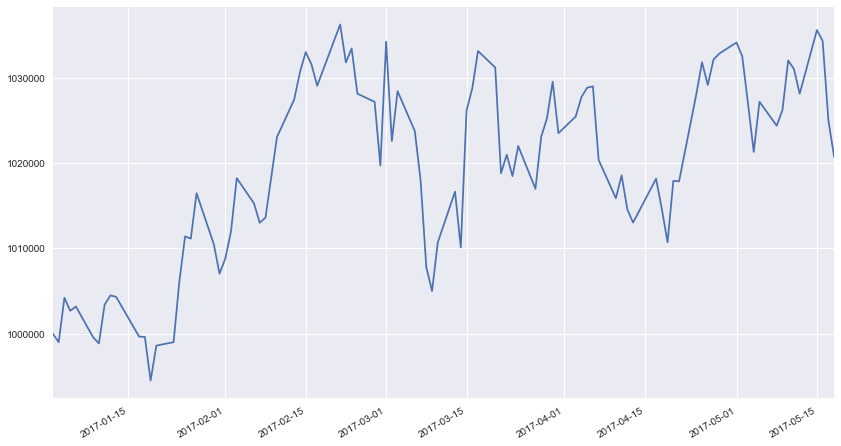
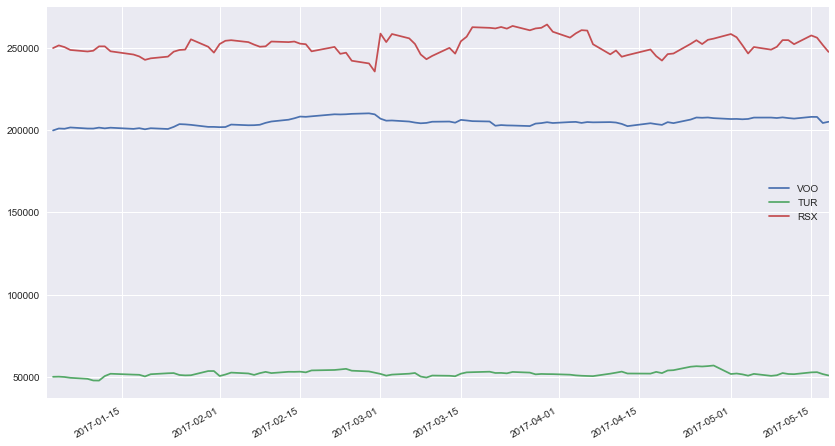

[](https://travis-ci.com/lambdaclass/options_backtester)

Options Backtester
==============================

Simple backtester to evaluate and analyse options strategies over historical price data.


- [Requirements](#requirements)
- [Setup](#setup)
- [Usage](#usage)
- [Recommended Reading](#recommended-reading)
- [Data Sources](#data-sources)


## Requirements

- Python >= 3.6
- pipenv

## Setup

Install [pipenv](https://pipenv.pypa.io/en/latest/)

```shell
$> pip install pipenv
```

Create environment and download dependencies

```shell
$> make install
```

Activate environment

```shell
$> make env
```

Run [Jupyter](https://jupyter.org) notebook

```shell
$> make notebook
```

Run tests

```shell
$> make test
```

## Usage

### Sample backtest

You can run this example by putting the code into a Jupyter Notebook/Lab file in this directory.


```python
import os
import sys

BACKTESTER_DIR = os.path.realpath(os.path.join(os.getcwd(), '.', '.'))
TEST_DATA_DIR = os.path.join(BACKTESTER_DIR, 'backtester', 'test', 'test_data')
SAMPLE_STOCK_DATA = os.path.join(TEST_DATA_DIR, 'test_data_stocks.csv')
SAMPLE_OPTIONS_DATA = os.path.join(TEST_DATA_DIR, 'test_data_options.csv')

sys.path.append(BACKTESTER_DIR) # Add backtester base dir to $PYTHONPATH
```


```python
from backtester import Backtest, Stock, Type, Direction
from backtester.datahandler import HistoricalOptionsData, TiingoData
from backtester.strategy import Strategy, StrategyLeg
```

First we construct an options datahandler.


```python
options_data = HistoricalOptionsData(SAMPLE_OPTIONS_DATA)
options_schema = options_data.schema
```

Next, we'll create a toy options strategy. It will simply buy a call and a put with `dte` between $80$ and $52$ and exit them a month later. 


```python
sample_strategy = Strategy(options_schema)

leg1 = StrategyLeg('leg_1', options_schema, option_type=Type.CALL, direction=Direction.BUY)
leg1.entry_filter = (options_schema.dte < 80) & (options_schema.dte > 52)

leg1.exit_filter = (options_schema.dte <= 52)

leg2 = StrategyLeg('leg_2', options_schema, option_type=Type.PUT, direction=Direction.BUY) 
leg2.entry_filter = (options_schema.dte < 80) & (options_schema.dte > 52)

leg2.exit_filter = (options_schema.dte <= 52)

sample_strategy.add_legs([leg1, leg2]);
```

We do the same for stocks: create a datahandler together with a list of the stocks we want in our inventory and their corresponding weights. In this case, we will hold `VOO`, `TUR` and `RSX`, with $0.4$, $0.1$ and $0.5$ weights respectively.


```python
stocks_data = TiingoData(SAMPLE_STOCK_DATA)
stocks = [Stock('VOO', 0.4), Stock('TUR', 0.1), Stock('RSX', 0.5)]
```

We set our portfolio allocation, i.e. how much of our capital will be invested in stocks, options and cash. We'll allocate 50% of our capital to stocks and the rest to options.


```python
allocation = {'stocks': 0.5, 'options': 0.5, 'cash': 0.0}
```

Finally, we create the `Backtest` object.


```python
bt = Backtest(allocation, initial_capital=1_000_000)

bt.stocks = stocks
bt.stocks_data = stocks_data

bt.options_strategy = sample_strategy
bt.options_data = options_data
```

And run the backtest with a rebalancing period of one month.


```python
bt.run(rebalance_freq=1)
```

    0% [██████████████████████████████] 100% | ETA: 00:00:00
    Total time elapsed: 00:00:00


<div>
<style scoped>
    .dataframe tbody tr th:only-of-type {
        vertical-align: middle;
    }

    .dataframe tbody tr th {
        vertical-align: top;
    }

    .dataframe thead tr th {
        text-align: left;
    }
</style>
<table border="1" class="dataframe">
  <thead>
    <tr>
      <th></th>
      <th colspan="7" halign="left">leg_1</th>
      <th colspan="7" halign="left">leg_2</th>
      <th colspan="3" halign="left">totals</th>
    </tr>
    <tr>
      <th></th>
      <th>contract</th>
      <th>underlying</th>
      <th>expiration</th>
      <th>type</th>
      <th>strike</th>
      <th>cost</th>
      <th>order</th>
      <th>contract</th>
      <th>underlying</th>
      <th>expiration</th>
      <th>type</th>
      <th>strike</th>
      <th>cost</th>
      <th>order</th>
      <th>cost</th>
      <th>qty</th>
      <th>date</th>
    </tr>
  </thead>
  <tbody>
    <tr>
      <th>0</th>
      <td>SPX170317C00300000</td>
      <td>SPX</td>
      <td>2017-03-17</td>
      <td>call</td>
      <td>300</td>
      <td>195010.0</td>
      <td>Order.BTO</td>
      <td>SPX170317P00300000</td>
      <td>SPX</td>
      <td>2017-03-17</td>
      <td>put</td>
      <td>300</td>
      <td>5.0</td>
      <td>Order.BTO</td>
      <td>195015.0</td>
      <td>2.0</td>
      <td>2017-01-03</td>
    </tr>
    <tr>
      <th>1</th>
      <td>SPX170317C00300000</td>
      <td>SPX</td>
      <td>2017-03-17</td>
      <td>call</td>
      <td>300</td>
      <td>-197060.0</td>
      <td>Order.STC</td>
      <td>SPX170317P00300000</td>
      <td>SPX</td>
      <td>2017-03-17</td>
      <td>put</td>
      <td>300</td>
      <td>-0.0</td>
      <td>Order.STC</td>
      <td>-197060.0</td>
      <td>2.0</td>
      <td>2017-02-01</td>
    </tr>
    <tr>
      <th>2</th>
      <td>SPX170421C00500000</td>
      <td>SPX</td>
      <td>2017-04-21</td>
      <td>call</td>
      <td>500</td>
      <td>177260.0</td>
      <td>Order.BTO</td>
      <td>SPX170421P01375000</td>
      <td>SPX</td>
      <td>2017-04-21</td>
      <td>put</td>
      <td>1375</td>
      <td>60.0</td>
      <td>Order.BTO</td>
      <td>177320.0</td>
      <td>2.0</td>
      <td>2017-02-01</td>
    </tr>
    <tr>
      <th>3</th>
      <td>SPX170421C00500000</td>
      <td>SPX</td>
      <td>2017-04-21</td>
      <td>call</td>
      <td>500</td>
      <td>-188980.0</td>
      <td>Order.STC</td>
      <td>SPX170421P01375000</td>
      <td>SPX</td>
      <td>2017-04-21</td>
      <td>put</td>
      <td>1375</td>
      <td>-5.0</td>
      <td>Order.STC</td>
      <td>-188985.0</td>
      <td>2.0</td>
      <td>2017-03-01</td>
    </tr>
    <tr>
      <th>4</th>
      <td>SPX170519C01000000</td>
      <td>SPX</td>
      <td>2017-05-19</td>
      <td>call</td>
      <td>1000</td>
      <td>138940.0</td>
      <td>Order.BTO</td>
      <td>SPX170519P01650000</td>
      <td>SPX</td>
      <td>2017-05-19</td>
      <td>put</td>
      <td>1650</td>
      <td>100.0</td>
      <td>Order.BTO</td>
      <td>139040.0</td>
      <td>3.0</td>
      <td>2017-03-01</td>
    </tr>
    <tr>
      <th>5</th>
      <td>SPX170519C01000000</td>
      <td>SPX</td>
      <td>2017-05-19</td>
      <td>call</td>
      <td>1000</td>
      <td>-135290.0</td>
      <td>Order.STC</td>
      <td>SPX170519P01650000</td>
      <td>SPX</td>
      <td>2017-05-19</td>
      <td>put</td>
      <td>1650</td>
      <td>-20.0</td>
      <td>Order.STC</td>
      <td>-135310.0</td>
      <td>3.0</td>
      <td>2017-04-03</td>
    </tr>
  </tbody>
</table>
</div>


The trade log (`bt.trade_log`) shows we executed 6 trades: we bought one call and one put on _2017-01-03_, _2017-02-01_ and _2017-03-01_, and exited those positions on _2017-02-01_, _2017-03-01_ and _2017-04-03_ respectively.

The balance data structure shows how our positions evolved over time:
- We started with $1000000 on _2017-01-02_
- `total capital` is the sum of `cash`, `stocks capital` and `options capital`
- `% change` shows the inter day change in `total capital`
- `accumulated return` gives the compounded return in `total capital` since the start of the backtest


```python
bt.balance.head()
```


<div>
<style scoped>
    .dataframe tbody tr th:only-of-type {
        vertical-align: middle;
    }

    .dataframe tbody tr th {
        vertical-align: top;
    }

    .dataframe thead th {
        text-align: right;
    }
</style>
<table border="1" class="dataframe">
  <thead>
    <tr style="text-align: right;">
      <th></th>
      <th>total capital</th>
      <th>cash</th>
      <th>VOO</th>
      <th>TUR</th>
      <th>RSX</th>
      <th>options qty</th>
      <th>calls capital</th>
      <th>puts capital</th>
      <th>stocks qty</th>
      <th>VOO qty</th>
      <th>TUR qty</th>
      <th>RSX qty</th>
      <th>options capital</th>
      <th>stocks capital</th>
      <th>% change</th>
      <th>accumulated return</th>
    </tr>
  </thead>
  <tbody>
    <tr>
      <th>2017-01-02</th>
      <td>1.000000e+06</td>
      <td>1000000.00000</td>
      <td>NaN</td>
      <td>NaN</td>
      <td>NaN</td>
      <td>NaN</td>
      <td>NaN</td>
      <td>NaN</td>
      <td>NaN</td>
      <td>NaN</td>
      <td>NaN</td>
      <td>NaN</td>
      <td>0.0</td>
      <td>0.000000</td>
      <td>NaN</td>
      <td>NaN</td>
    </tr>
    <tr>
      <th>2017-01-03</th>
      <td>9.990300e+05</td>
      <td>110117.40592</td>
      <td>199872.763320</td>
      <td>49993.281167</td>
      <td>249986.549593</td>
      <td>2.0</td>
      <td>389060.0</td>
      <td>0.0</td>
      <td>16186.0</td>
      <td>1025.0</td>
      <td>1758.0</td>
      <td>13403.0</td>
      <td>389060.0</td>
      <td>499852.594080</td>
      <td>-0.000970</td>
      <td>0.999030</td>
    </tr>
    <tr>
      <th>2017-01-04</th>
      <td>1.004228e+06</td>
      <td>110117.40592</td>
      <td>201052.238851</td>
      <td>50072.862958</td>
      <td>251605.333911</td>
      <td>2.0</td>
      <td>391380.0</td>
      <td>0.0</td>
      <td>16186.0</td>
      <td>1025.0</td>
      <td>1758.0</td>
      <td>13403.0</td>
      <td>391380.0</td>
      <td>502730.435720</td>
      <td>0.005203</td>
      <td>1.004228</td>
    </tr>
    <tr>
      <th>2017-01-05</th>
      <td>1.002706e+06</td>
      <td>110117.40592</td>
      <td>200897.553535</td>
      <td>49865.950301</td>
      <td>250564.686850</td>
      <td>2.0</td>
      <td>391260.0</td>
      <td>0.0</td>
      <td>16186.0</td>
      <td>1025.0</td>
      <td>1758.0</td>
      <td>13403.0</td>
      <td>391260.0</td>
      <td>501328.190686</td>
      <td>-0.001516</td>
      <td>1.002706</td>
    </tr>
    <tr>
      <th>2017-01-06</th>
      <td>1.003201e+06</td>
      <td>110117.40592</td>
      <td>201680.647945</td>
      <td>49372.543196</td>
      <td>248830.275081</td>
      <td>2.0</td>
      <td>393200.0</td>
      <td>0.0</td>
      <td>16186.0</td>
      <td>1025.0</td>
      <td>1758.0</td>
      <td>13403.0</td>
      <td>393200.0</td>
      <td>499883.466222</td>
      <td>0.000494</td>
      <td>1.003201</td>
    </tr>
  </tbody>
</table>
</div>


Evolution of our total capital over time:


```python
bt.balance['total capital'].plot();
```





Evolution of our stock positions over time:


```python
bt.balance[[stock.symbol for stock in stocks]].plot();
```





More plots and statistics are available in the `backtester.statistics` module.

### Other strategies

The `Strategy` and `StrategyLeg` classes allow for more complex strategies; for instance, a [long strangle](https://www.investopedia.com/terms/s/strangle.asp) could be implemented like so:


```python
# Long strangle
leg_1 = StrategyLeg('leg_1', options_schema, option_type=Type.PUT, direction=Direction.BUY)
leg_1.entry_filter = (options_schema.underlying == 'SPX') & (options_schema.dte >= 60) & (options_schema.underlying_last <= 1.1 * options_schema.strike)
leg_1.exit_filter = (options_schema.dte <= 30)

leg_2 = StrategyLeg('leg_2', options_schema, option_type=Type.CALL, direction=Direction.BUY)
leg_2.entry_filter = (options_schema.underlying == 'SPX') & (options_schema.dte >= 60) & (options_schema.underlying_last >= 0.9 * options_schema.strike)
leg_2.exit_filter = (options_schema.dte <= 30)

strategy = Strategy(options_schema)
strategy.add_legs([leg_1, leg_2]);
```

You can explore more usage examples in the Jupyter [notebooks](backtester/examples/).


## Recommended reading

For complete novices in finance and economics, this [post](https://notamonadtutorial.com/how-to-earn-your-macroeconomics-and-finance-white-belt-as-a-software-developer-136e7454866f) gives a comprehensive introduction.


### Books

#### Introductory
- Option Volatility and Pricing 2nd Ed. - Natemberg, 2014
- Options, Futures, and Other Derivatives 10th Ed. - Hull 2017
- Trading Options Greeks: How Time, Volatility, and Other Pricing Factors Drive Profits 2nd Ed. - Passarelli 2012

#### Intermediate
- Trading Volatility - Bennet 2014
- Volatility Trading 2nd Ed. - Sinclair 2013

#### Advanced
- Dynamic Hedging - Taleb 1997
- The Volatility Surface: A Practitioner's Guide - Gatheral 2006
- The Volatility Smile - Derman & Miller 2016

### Papers
- [Volatility: A New Return Driver?](http://static.squarespace.com/static/53974e3ae4b0039937edb698/t/53da6400e4b0d5d5360f4918/1406821376095/Directional%20Volatility%20Research.pdf)
- [Easy Volatility Investing](https://papers.ssrn.com/sol3/papers.cfm?abstract_id=2255327)
- [Everybody’s Doing It: Short Volatility Strategies and Shadow Financial Insurers](https://papers.ssrn.com/sol3/papers.cfm?abstract_id=3071457)
- [Volatility-of-Volatility Risk](https://papers.ssrn.com/sol3/papers.cfm?abstract_id=2497759)
- [The Distribution of Returns](https://papers.ssrn.com/sol3/papers.cfm?abstract_id=2828744)
- [Safe Haven Investing Part I - Not all risk mitigation is created equal](https://www.universa.net/UniversaResearch_SafeHavenPart1_RiskMitigation.pdf)
- [Safe Haven Investing Part II - Not all risk is created equal](https://www.universa.net/UniversaResearch_SafeHavenPart2_NotAllRisk.pdf)
- [Safe Haven Investing Part III - Those wonderful tenbaggers](https://www.universa.net/UniversaResearch_SafeHavenPart3_Tenbaggers.pdf)
- [Insurance makes wealth grow faster](https://arxiv.org/abs/1507.04655)
- [Ergodicity economics](https://ergodicityeconomics.files.wordpress.com/2018/06/ergodicity_economics.pdf)
- [The Rate of Return on Everything, 1870–2015](https://economics.harvard.edu/files/economics/files/ms28533.pdf)
- [Volatility and the Alchemy of Risk](https://static1.squarespace.com/static/5581f17ee4b01f59c2b1513a/t/59ea16dbbe42d6ff1cae589f/1508513505640/Artemis_Volatility+and+the+Alchemy+of+Risk_2017.pdf)

## Data sources

### Exchanges

- [IEX](https://iextrading.com/developer/)
- [Tiingo](https://api.tiingo.com/)
- [CBOE Options Data](http://www.cboe.com/delayedquote/quote-table-download)

### Historical Data

- [Shiller's US Stocks, Dividends, Earnings, Inflation (CPI), and long term interest rates](http://www.econ.yale.edu/~shiller/data.htm)
- [Fama/French US Stock Index Data](http://mba.tuck.dartmouth.edu/pages/faculty/ken.french/data_library.html)
- [FRED CPI, Interest Rates, Trade Data](https://fred.stlouisfed.org)
- [REIT Data](https://www.reit.com/data-research/reit-market-data/reit-industry-financial-snapshot)
